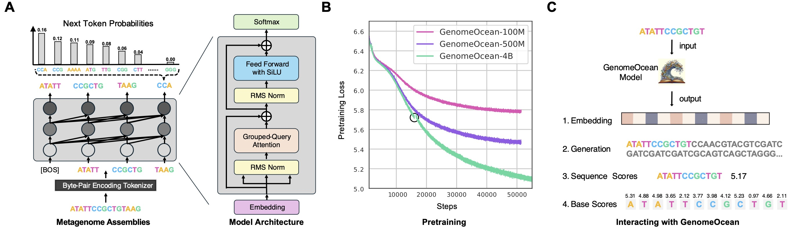

# [GenomeOcean: An Efficient Genome Foundation Model Trained on Large-Scale Metagenomic Assemblies](https://www.biorxiv.org/content/10.1101/2025.01.30.635558v1)




## 1. Installation

### 1.1 Docker
We provide a Docker image for GenomeOcean. See `docker/` for more information.


### 1.2 Conda/pip

#### Pre-requisites: Python 3.11 tested
```bash
# Create a new conda environment
conda create -n GO python=3.11
conda activate GO
```

#### Install GenomeOcean package

from pip:
```bash
pip install genomeocean
```

from source:
```bash
pip install git+https://github.com/jgi-genomeocean/genomeocean
```

## 2. Usage

GenomeOcean is compatible with all the standard HuggingFace APIs. We publish the following checkpoints on HuggingFace:

| Checkpoint                                   | Description                                                  |
| -------------------------------------------- | ------------------------------------------------------------ |
| [pGenomeOcean/GenomeOcean-100M](https://huggingface.co/pGenomeOcean/GenomeOcean-100M)                  | The base model with 100M parameters. Support maximum sequence length of 1024 tokens (~5,100 bp). |
| [pGenomeOcean/GenomeOcean-500M](https://huggingface.co/pGenomeOcean/GenomeOcean-500M)                  | The base model with 500M parameters. Support maximum sequence length of 1024 tokens (~5,100 bp). |
| [pGenomeOcean/GenomeOcean-4B](https://huggingface.co/pGenomeOcean/GenomeOcean-4B)                    | The base model with 4B parameters. Support maximum sequence length of 10240 tokens (~51,000 bp). |
| [pGenomeOcean/GenomeOcean-4B-bgcFM](https://huggingface.co/pGenomeOcean/GenomeOcean-4B-bgcFM)             | The `GenomeOcean-4B` model finetuned on 11M biosynthetic gene clusters (BGC) sequences. Support maximum sequence length of 10240 tokens (~51,000 bp). |
| [pGenomeOcean/GenomeOcean-4B-Artificial-Detector](https://huggingface.co/pGenomeOcean/GenomeOcean-4B-Artificial-Detector)   | The `GenomeOcean-4B` model finetuned to detected GenomeOcean-generated sequences. A binary classifier where label `0` indicate artificial sequences. |

We recommend using the `GenomeOcean-4B` model for general-purpose genome sequence analysis. The `GenomeOcean-4B-bgcFM` model is fine-tuned on BGC sequences and can be used for BGC-related tasks. The smaller models (`GenomeOcean-100M` and `GenomeOcean-500M`) can be used when GPU memory is limited, but the performance may be largely compromised.

### 2.1. Sequence Embedding
```python
from genomeocean.llm_utils import LLMUtils

sequences = [
    "GCCGCTAAAAAGCGACCAGAATGATCCAAAAAAGAAGGCAGGCCAGCACCATCCGTTTTTTACAGCTCCAGAACTTCCTTT", 
    "CAGTCAGTGGCTAGCATGCTAGCATCGATCGATCGATCGATCGATCGATCGATCGGTGCATGCTAGCATCGATCGATCGAA"
]
llm = LLMUtils('pGenomeOcean/GenomeOcean-4B')
embeddings = llm.predict(sequences, batch_size=2, do_embedding=True) # batch_size can be adjusted based on GPU memory and sequence length
print(embeddings.shape)  # (2, 3072)
print(type(embeddings)) # numpy.ndarray

```

### 2.2. Sequence Generation (Python API)
```python
from genomeocean.generation import SequenceGenerator
sequences = [
    "GCCGCTAAAAAGCGACCAGAATGATCCAAAAAAGAAGGCAGGCCAGCACCATCCGTTTTTTACAGCTCCAGAACTTCCTTT", 
    "CAGTCAGTGGCTAGCATGCTAGCATCGATCGATCGATCGATCGATCGATCGATCGGTGCATGCTAGCATCGATCGATCGAA"
]
seq_gen = SequenceGenerator(
    model_dir='pGenomeOcean/GenomeOcean-4B', # model_dir can also be the path to a local copy of the model
    prompts=sequences, # Provide a list of DNA sequences as prompts
    promptfile='', # or provide a file contains DNA sequences as prompts
    num=10, # number of sequences to generate for each prompt
    min_seq_len=100, # minimum length of generated sequences in token, set it as expected bp length // 4 (e.g., set it as 1000 for 4kb)
    max_seq_len=100, # maximum length of generated sequences in token, max value is 10240
    temperature=1.3, # temperature for sampling
    top_k=-1, # top_k for sampling
    top_p=0.7, # top_p for sampling
    presence_penalty=0.5, # presence penalty for sampling
    frequency_penalty=0.5, # frequency penalty for sampling
    repetition_penalty=1.0, # repetition penalty for sampling
    seed=123, # random seed for sampling
)
all_generated = seq_gen.generate_sequences(
    prepend_prompt_to_output=True, # set to False to only save the generated sequence
    max_repeats=0, # set to k to remove sequences with more than k% simple repeats, set to 0 to return all the generated sequences
)
seq_gen.save_sequences(
    all_generated, 
    out_prefix='debug/seqs', # output file prefix, the final output file will be named as path/to/output.txt or path/to/output.fa
    out_format='txt' # or 'fa' for fasta format,
)
```

### 2.3. Sequence Generation (Script)

Generate 100 BGCs in zero-shot mode
```bash
go_generate.py --model bgc --zero_shot --preset creative_long --num 100
```
Autocomplete a known siderophore BGC from MIBiG (https://mibig.secondarymetabolites.org/repository/BGC0000947.5)
```bash
go_generate.py --model bgc --prompts CGTTTAAAAATAGTGGAAGATCGGCGGTTCATGCATCAAGAAGTTTTGATGGGAGATGTTCCACGCATAGGCGCCCGCTAAGGTAAACACAACGTAATCACCAATATCGACGTGGGCGACGTGTTGATTGCGTGCCAGCACATCTTTGGGCGTACAAAGCTGGCCGACAAAGGTCGCTTGTGCATGCTGAATTGGATGAGAAATCTCATGGTGTTGCTCGCTTTTCAGGATGACGAATGGATGATCATGGCTCTGCGCCGCTGGCGTGCGGAAGTGGTGAGTTCCTCCGCGCGCGATGACAAAGTTTTCGCCAAGATTTTGTTTAATATCCAGTACTTCCATCACGTAATAACCGCATGCCGCCGTGATGAAACGTCCGCATTCAAAACGCAGTGTCCAGTCTTGCACTTGCTCTTTGGCGATGAGGAATTCCAACTTGTCGCAAAACTCCATCCACGGAAAGTGTTGCTCAGGGTTTTGGTAGTTAATCCCCATACCGCCGCCCAAGTTGATCATCAGCTCACTGAGTTTGAACTCCTGCTGCCACGTTTTCACGACTTGGAAATAGCGCTGCATTAACGCTAAGTGACGTTCAACATCGAGCTGATGCGACATCAAGTGAAAATGGAAGCCTTTGAGTGACACTTGCGGGAAATCGCGCAGCAACATCAAAGCATTACTCAGCTCGGACTCGTCCAAGCCAAATGGAGTCGGCTTGCCACCCATCGCCAACTTGCTGAGCGTGATGTCGCCAATATCGATGTTCATACGCA --preset conservative_long --num 100
```

### 2.4. Genome Loss Scores Scanning (Script)

This will produce a pickle file containing a dictionary, with contig ID as keys and loss scores as values in the form of a numpy array.

Calculate per base loss scores using the base model
```bash
go_scan.py input_genome.fna.gz output_pkl_prefix
```

Calculate per base loss scores using the combined bgc and base model (as in the paper)
```bash
go_scan.py --mode bgc_substracted input_genome.fna.gz output_pkl_prefix
```

### 2.5. more examples

please see the folder `examples/`

### 2.5. HuggingFace API

```python
# Load model
import torch
from transformers import AutoModelForCausalLM, AutoTokenizer
tokenizer = AutoTokenizer.from_pretrained(
    "pGenomeOcean/GenomeOcean-4B",
    trust_remote_code=True,
    padding_side="left",
)
model = AutoModelForCausalLM.from_pretrained(
    "pGenomeOcean/GenomeOcean-4B",
    trust_remote_code=True,
    torch_dtype=torch.bfloat16, 
    attn_implementation="flash_attention_2",
).to("cuda") 
# Embedding
sequences = [
    "GCCGCTAAAAAGCGACCAGAATGATCCAAAAAAGAAGGCAGGCCAGCACCATCCGTTTTTTACAGCTCCAGAACTTCCTTT", 
    "CAGTCAGTGGCTAGCATGCTAGCATCGATCGATCGATCGATCGATCGATCGATCGGTGCATGCTAGCATCGATCGATCGAA"
]
output = tokenizer.batch_encode_plus(
    sequences,
    max_length=10240,
    return_tensors='pt',
    padding='longest',
    truncation=True
)
input_ids = output['input_ids'].cuda()
attention_mask = output['attention_mask'].cuda()
model_output = model.forward(input_ids=input_ids, attention_mask=attention_mask)[0].detach().cpu()
attention_mask = attention_mask.unsqueeze(-1).detach().cpu()
embedding = torch.sum(model_output * attention_mask, dim=1) / torch.sum(attention_mask, dim=1)
print(f"Shape: {embedding.shape}") # (2, 3072)
# Generation
sequences = [
    "GCCGCTAAAAAGCGACCAGAATGATCCAAAAAAGAAGGCAGGCCAGCACCATCCGTTTTTTACAGCTCCAGAACTTCCTTT", 
    "CAGTCAGTGGCTAGCATGCTAGCATCGATCGATCGATCGATCGATCGATCGATCGGTGCATGCTAGCATCGATCGATCGAA"
]
input_ids = tokenizer(sequence, return_tensors='pt', padding=True)["input_ids"]
input_ids = input_ids[:, :-1].to("cuda")   # remove the [SEP] token at the end
model_output = model.generate(
    input_ids=input_ids,
    min_new_tokens=10,
    max_new_tokens=10,
    do_sample=True,
    top_p=0.9,
    temperature=1.0,
    num_return_sequences=1,
)
generated = tokenizer.decode(model_output[0]).replace(" ", "")[5+len(sequence):]
print(f"Generated sequence: {generated}")

```


## 3. Contribute

Please submit pull requests and issues to the main branch.

## 4. Citation

Zhou, Zhihan, et al. "GenomeOcean: An Efficient Genome Foundation Model Trained on Large-Scale Metagenomic Assemblies." bioRxiv (2025): 2025-01. (https://www.biorxiv.org/content/10.1101/2025.01.30.635558v1.full)

```
@article{zhou2025genomeocean,
  title={GenomeOcean: An Efficient Genome Foundation Model Trained on Large-Scale Metagenomic Assemblies},
  author={Zhou, Zhihan and Riley, Robert and Kautsar, Satria and Wu, Weimin and Egan, Rob and Hofmeyr, Steven and Goldhaber-Gordon, Shira and Yu, Mutian and Ho, Harrison and Liu, Fengchen and others},
  journal={bioRxiv},
  pages={2025--01},
  year={2025},
  publisher={Cold Spring Harbor Laboratory}
}
```

## 5. Copyright Notice

genomeocean: a pretrained microbial genome foundational model (genomeoceanLLM) ” Copyright (c) 2025, The Regents of the
University of California, through Lawrence Berkeley National Laboratory (subject to receipt of any required approvals from the U.S. Dept. of Energy) and Northwestern University. All rights reserved.

If you have questions about your rights to use or distribute this software,
please contact Berkeley Lab's Intellectual Property Office at
IPO@lbl.gov.

NOTICE.  This Software was developed under funding from the U.S. Department
of Energy and the U.S. Government consequently retains certain rights.  As
such, the U.S. Government has been granted for itself and others acting on
its behalf a paid-up, nonexclusive, irrevocable, worldwide license in the
Software to reproduce, distribute copies to the public, prepare derivative 
works, and perform publicly and display publicly, and to permit others to do so.


