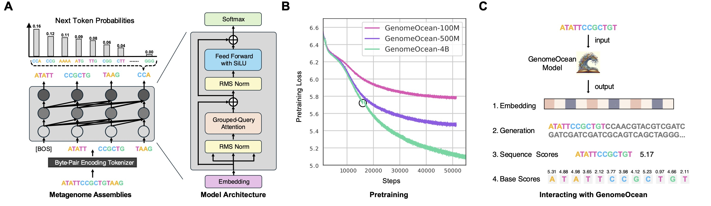

# GenomeOcean: An Efficient Genome Foundation Model Trained on Large-Scale Metagenomic Assemblies




## 1. Installation

### 1.1 Docker or Apptainer (Recommended)
We provide container images for GenomeOcean, which is the recommended way to run the software due to complex dependencies like CUDA and vLLM. See `docker/` and `apptainer/` for more information on building the images.

### 1.2 uv (Alternative)

If you prefer to run locally without containers, we recommend using `uv` for dependency management.

#### Pre-requisites: Python 3.10 - 3.12 (tested)
Install `uv` if you haven't already:
```bash
# On macOS and Linux
curl -LsSf https://astral.sh/uv/install.sh | sh
```

Create a virtual environment and install dependencies:
```bash
# Create a new virtual environment
uv venv GO --python 3.12
source GO/bin/activate

# Install GenomeOcean package and dependencies
# This will install all dependencies including vllm, torch, etc.
uv pip install -e ".[all]"


#### Running Tests
```bash
python -m unittest unittests.py
```

## 2. Usage

GenomeOcean is compatible with all the standard HuggingFace APIs. We publish the following checkpoints on HuggingFace:

| Checkpoint                                   | Description                                                  |
| -------------------------------------------- | ------------------------------------------------------------ |
| [pGenomeOcean/GenomeOcean-100M](https://huggingface.co/DOEJGI/GenomeOcean-100M)                  | The base model with 100M parameters. Support maximum sequence length of 1024 tokens (~5,100 bp). |
| [pGenomeOcean/GenomeOcean-500M](https://huggingface.co/DOEJGI/GenomeOcean-500M)                  | The base model with 500M parameters. Support maximum sequence length of 1024 tokens (~5,100 bp). |
| [pGenomeOcean/GenomeOcean-4B](https://huggingface.co/DOEJGI/GenomeOcean-4B)                    | The base model with 4B parameters. Support maximum sequence length of 10240 tokens (~51,000 bp). |
| [pGenomeOcean/GenomeOcean-4B-bgcFM](https://huggingface.co/DOEJGI/GenomeOcean-4B-bgcFM)             | The `GenomeOcean-4B` model finetuned on 11M biosynthetic gene clusters (BGC) sequences. Support maximum sequence length of 10240 tokens (~51,000 bp). |
| [pGenomeOcean/GenomeOcean-4B-Artificial-Detector](https://huggingface.co/DOEJGI/GenomeOcean-4B-Artificial-Detector)   | The `GenomeOcean-4B` model finetuned to detected GenomeOcean-generated sequences. A binary classifier where label `0` indicate artificial sequences. |

We recommend using the `GenomeOcean-4B` model for general-purpose genome sequence analysis. The `GenomeOcean-4B-bgcFM` model is fine-tuned on BGC sequences and can be used for BGC-related tasks. The smaller models (`GenomeOcean-100M` and `GenomeOcean-500M`) can be used when GPU memory is limited, but the performance may be compromised.

### 2.1 Unified CLI — `go-infer`

After installation, the `go-infer` command is available with four sub-commands:

```
go-infer generate      # de-novo or prompt-conditioned sequence generation
go-infer autocomplete  # complete a partial protein-coding gene + structure scoring
go-infer embed         # compute embedding vectors from sequences
go-infer score         # compute NLL loss for sequences or a whole genome
```

Run `go-infer <sub-command> --help` to see all options for each mode.

#### 2.1.1 Sequence Generation

Generate sequences conditioned on prompts from a file (`.txt`, `.fa`, or `.csv`):

```bash
go-infer generate \
    --model_dir pGenomeOcean/GenomeOcean-4B \
    --promptfile sample_data/dna_sequences.txt \
    --out_prefix outputs/generated \
    --out_format fa \
    --num 10 \
    --min_seq_len 100 \
    --max_seq_len 100 \
    --temperature 1.3 \
    --top_k -1 \
    --top_p 0.7 \
    --presence_penalty 0.5 \
    --frequency_penalty 0.5 \
    --repetition_penalty 1.0 \
    --filter_compression \
    --compression_threshold 0.33 \
    --filter_loss \
    --loss_threshold 3.5 \
    --seed 123 \
    --sort_by_orf_length
```

Omit `--promptfile` for **de-novo** (unconditional) generation. For sequences longer than 10,240 tokens, the CLI automatically switches to a chained long-generation mode.

**Enhanced Generation Options:**
- `--filter_compression`: If enabled, filters out generated sequences that contain low-complexity repeats using a COMPRESSION_THRESHOLD (default: disabled). Do not use this on short sequences.
- `--compression_threshold COMPRESSION_THRESHOLD`: The compression threshold. Only effective if `--filter_compression` is enabled (default: 0.33). Suggested value: no more than 0.33 (sequences can be compressed by 3 times).
- `--filter_loss`: Filter sequences below `--loss_threshold` (default: disabled).
- `--loss_threshold LOSS_THRESHOLD`: Use this option to remove sequences that have low loss scores (greedy generation). Only effective if `--filter_loss` is enabled (default: 3.5). Suggested value: no more than 3.5.

#### 2.1.2 Gene Autocomplete

Complete a partial protein-coding gene and optionally score generated structures against a reference:

```bash
go-infer autocomplete \
    --model_dir pGenomeOcean/GenomeOcean-4B \
    --gen_id NZ_JAYXHC010000003.1 \
    --start 157 --end 1698 \
    --strand -1 \
    --prompt_start 0 --prompt_end 600 \
    --structure_start 150 --structure_end 500 \
    --num 100 \
    --min_seq_len 250 --max_seq_len 300 \
    --foldmason_path ~/bin/foldmason \
    --filter_compression \
    --compression_threshold 0.33 \
    --filter_loss \
    --loss_threshold 3.5 \
    --output_prefix outputs/gmp
```

Structure scoring requires [FoldMason](https://github.com/steineggerlab/foldmason). Omit `--foldmason_path` to skip it.

#### 2.1.3 Sequence Embedding

Compute mean-pool embedding vectors (saved as `.npy`):

```bash
go-infer embed \
    --model_dir pGenomeOcean/GenomeOcean-4B \
    --sequence_file sample_data/dna_sequences.txt \
    --model_max_length 256 \
    --batch_size 10 \
    --out_file outputs/embeddings.npy
```

`--model_max_length` should be set to approximately `sequence_length_bp / 4`.

#### 2.1.4 Loss / Perplexity Scoring

**Per-sequence NLL loss** (scalar per sequence, printed to stdout or saved as `.pkl`):

```bash
go-infer score \
    --model_dir pGenomeOcean/GenomeOcean-4B \
    --sequence_file sample_data/dna_sequences.txt \
    --out_prefix outputs/scores
```

**Genome-wide scan** (per-base token loss, output as `<prefix>.pkl`):

```bash
go-infer score \
    --model_dir pGenomeOcean/GenomeOcean-4B-bgcFM \
    --genome_file my_genome.fa.gz \
    --mode genome \
    --segment_size 50000 \
    --overlap_size 5000 \
    --use_reverse \
    --out_prefix outputs/scan
```

Pass `--use_perplexity` to return exp(NLL) instead of raw NLL loss.

---

### 2.2 Python API

All inference modes are also accessible as a Python class for programmatic use:

```python
from genomeocean.inference import GenomeOceanInference

go = GenomeOceanInference(model_dir="pGenomeOcean/GenomeOcean-4B")

# Generate sequences
df = go.generate(
    promptfile="prompts.fa", 
    num=10, 
    filter_compression=True,
    compression_threshold=0.33, 
    filter_loss=True, 
    loss_threshold=3.5
)
go.save_sequences(df, out_prefix="outputs/gen", out_format="fa")

# Embed
import numpy as np
emb = go.embed(sequence_file="seqs.txt", model_max_length=256)  # (N, hidden)
np.save("embeddings.npy", emb)

# Score
scores = go.score(sequence_file="seqs.txt")          # per-sequence NLL
scores = go.score(genome_file="genome.fa.gz", mode="genome")  # genome scan
```

The model is **lazy-loaded** on the first call — importing the class costs nothing.

---

### 2.3 More examples

See the `examples/` folder for advanced usage including autocomplete with structure scoring and artificial sequence detection.


## 3. Contribute

Please submit pull requests and issues to the main branch.

## 4. Citation

[Uncovering the Genomic Manifold via Scalable Learning from the Global Microbiome](https://www.biorxiv.org/content/10.1101/2025.01.30.635558v2.full)

```
@article{zhou2025genomeocean,
  title={GenomeOcean: An Efficient Genome Foundation Model Trained on Large-Scale Metagenomic Assemblies},
  author={Zhou, Zhihan and Riley, Robert and Kautsar, Satria and Wu, Weimin and Egan, Rob and Hofmeyr, Steven and Goldhaber-Gordon, Shira and Yu, Mutian and Ho, Harrison and Liu, Fengchen and others},
  journal={bioRxiv},
  pages={2025--01},
  year={2025},
  publisher={Cold Spring Harbor Laboratory}
}
```

## 5. Copyright Notice

genomeocean: a pretrained microbial genome foundational model (genomeoceanLLM) ” Copyright (c) 2025, The Regents of the
University of California, through Lawrence Berkeley National Laboratory (subject to receipt of any required approvals from the U.S. Dept. of Energy) and Northwestern University. All rights reserved.

If you have questions about your rights to use or distribute this software,
please contact Berkeley Lab's Intellectual Property Office at
IPO@lbl.gov.

NOTICE.  This Software was developed under funding from the U.S. Department
of Energy and the U.S. Government consequently retains certain rights.  As
such, the U.S. Government has been granted for itself and others acting on
its behalf a paid-up, nonexclusive, irrevocable, worldwide license in the
Software to reproduce, distribute copies to the public, prepare derivative 
works, and perform publicly and display publicly, and to permit others to do so.


